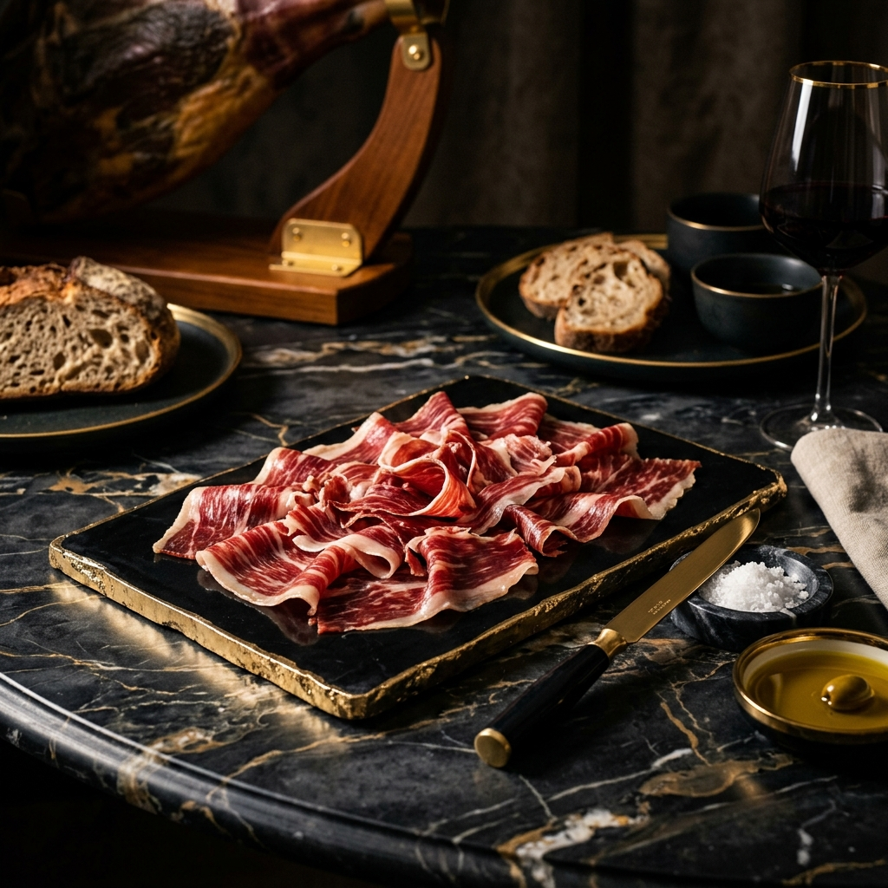

<div align="center">
  


# ✨ LA ABACERÍA ✨
### Maestros del Ibérico • Selección Gourmet de Lujo

[](https://astro.build/)
[](https://tailwindcss.com/)
[](https://greensock.com/)
[](https://www.typescriptlang.org/)

**Una boutique digital premium diseñada para transmitir la excelencia de la gastronomía artesana.**
*Especialistas en Selección de Ibéricos en Huelva.*

---

[🌐 Visitar Boutique](https://laabaceria.ivangonzalez.cloud/) • [📋 Catálogo Gourmet](#) • [📩 Contacto](https://ivangonzalez.cloud)

</div>

## 🏺 Sobre el Proyecto

**La Abacería** es una experiencia digital inmersiva creada para los maestros en la selección de jamones y productos gourmet. El diseño busca replicar la exclusividad de una tienda física de alta gama a través de una interfaz **Obsidian & Gold**, tipografías elegantes y transiciones fluidas.

### Propósito:
- **Lujo Visual:** Crear una atmósfera de exclusividad desde el primer impacto visual.
- **Autoridad Artesana:** Presentar la selección de productos con un enfoque editorial y profesional.
- **Navegación Fluida:** Facilitar el descubrimiento de productos mediante una arquitectura de información optimizada.

## 🛠️ Stack Tecnológico

| Tecnología | Propósito |
| :--- | :--- |
| **Astro** | Framework de ultra-rendimiento enfocado en la velocidad y el SEO. |
| **TypeScript** | Tipado estricto para una base de código robusta y escalable. |
| **Tailwind CSS** | Sistema de diseño utilitario para una estética premium y consistente. |
| **GSAP** | Animaciones cinemáticas y control total del scroll-design. |
| **Lucide Icons** | Iconografía minimalista adaptada al sector de lujo. |

## 💎 Características Principales

- 🍖 **Diseño Editorial:** Layouts asimétricos inspirados en revistas de alta gastronomía.
- 📱 **Fully Responsive:** Experiencia de lujo adaptada perfectamente a cualquier dispositivo.
- ⚡ **Zero-JS by Default:** Máximo rendimiento gracias a la arquitectura de islas de Astro.
- 🎭 **Motion Design:** Micro-interacciones suaves que aportan una capa de sofisticación táctil.
- 🔒 **SEO Gourmet:** Estructura semántica optimizada para el posicionamiento de productos artesanos.

## 🚀 Instalación y Desarrollo

Si deseas clonar y ejecutar este proyecto localmente:

1. **Clonar el repositorio:**
   ```bash
   git clone https://github.com/jukk4p/laabaceria.git
   cd laabaceria
   ```

2. **Instalar dependencias:**
   ```bash
   npm install
   ```

3. **Ejecutar servidor de desarrollo:**
   ```bash
   npm run dev
   ```
   El sitio estará disponible en `http://localhost:4321`.

## 📦 Despliegue y Producción

El proyecto está optimizado para un despliegue de alto rendimiento:
- **Build:** `npm run build` genera una versión estática optimizada al 100%.
- **Hosting:** Diseñado para brillar en Vercel, Netlify o Railway.

---

<div align="center">
<p>Diseñado con ❤️ por <b>Antigravity</b> para La Abacería.</p>
<p>© 2025 La Abacería - Maestros del Ibérico. Todos los derechos reservados.</p>
</div>
