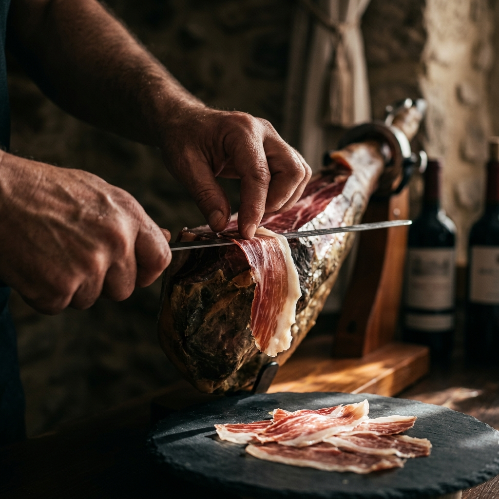

# La Abacería - Maestros del Ibérico

Una plataforma e-commerce de lujo diseñada para **La Abacería**, maestros en la selección de jamones y productos artesanos de Huelva, con sede en Coria del Río. Este proyecto moderniza la presencia digital de la marca utilizando una estética **Obsidian & Gold** de alta gama.



## ✨ Características Principales

- **Diseño Obsidian & Gold**: Estética de lujo basada en negros profundos, dorados artesanales y efectos de cristal líquido (Glassmorphism).
- **Experiencia Editorial**: Layouts fluidos y tipografía premium (Cormorant Garamond & Montserrat) que elevan la percepción del producto.
- **Navegación Multi-página**: Estructura completa con secciones de Catálogo, Historia (Nosotros), Contacto y áreas legales.
- **Animaciones Cinematográficas**: Implementación de **GSAP** para revelados de imagen y transiciones suaves impulsadas por el scroll.
- **Optimización de Contenido**: Imágenes de alta fidelidad que destacan la textura y calidad de los productos gourmet.
- **SEO & Performance**: Estructura semántica, metatags optimizados y tiempos de carga mínimos gracias a Next.js.

## 🛠️ Stack Tecnológico

- **Framework**: [Next.js 16](https://nextjs.org/) (App Router)
- **Biblioteca UI**: [React 19](https://react.dev/)
- **Lenguaje**: [TypeScript](https://www.typescriptlang.org/)
- **Estilado**: Vanilla CSS (Modern Design Tokens)
- **Animaciones**: [GSAP](https://greensock.com/gsap/) + ScrollTrigger

## 🚀 Inicio Rápido

### Requisitos Previos

- Node.js 20 o superior
- npm / yarn / pnpm

### Instalación

1. Clona el repositorio:
   ```bash
   git clone https://github.com/jukk4p/laabaceria.git
   ```

2. Instala las dependencias:
   ```bash
   npm install
   ```

3. Inicia el servidor de desarrollo:
   ```bash
   npm run dev
   ```

4. Abre [http://localhost:3000](http://localhost:3000) en tu navegador.

## 📁 Estructura del Proyecto

- `/src/app`: Rutas y lógica de páginas principales.
- `/src/components`: Componentes modulares (Navbar, Footer, Gallery, etc.).
- `/public`: Assets estáticos e imágenes de alta calidad.
- `globals.css`: Definición del sistema de diseño y tokens de marca.

---
Diseñado y desarrollado para representar la excelencia artesana de **La Abacería**.
